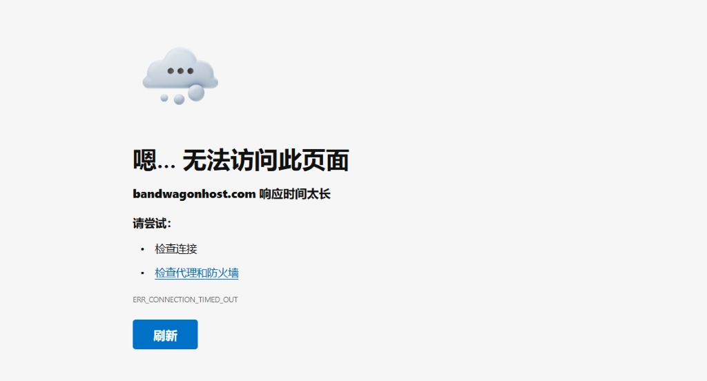

# Can't Access BandwagonHost Official Site? Here's What You Need to Know

If you've been trying to buy a BandwagonHost VPS or renew your existing server lately, you might have noticed something frustrating: the official site bandwagonhost.com just won't load. Since 2019, the main domain has been inaccessible from mainland China due to DNS pollution and network restrictions. But here's the good news—BandwagonHost has set up multiple official mirror sites specifically for users facing this issue, and they work exactly like the main site.

---

# Complete List of Official BandwagonHost Mirror Sites

BandwagonHost maintains several mirror sites to help users bypass access issues. These mirrors are fully functional—you can register, purchase plans, renew services, and manage your VPS just like on the main site. My advice? Start with the newest mirrors first. They're usually more stable and faster.

If the first mirror doesn't load or feels sluggish, just move down the list and try the next one.

**Official Mirror Sites:**

* bwh88.net
* bwh89.net
* bwh81.net
* bwh1.net

The pattern here is simple: BandwagonHost regularly releases new mirrors to stay ahead of network blocks. I keep this list updated, so you're always getting the most current working addresses.

Here's the strategy: **always try the newest mirror first**. Older mirrors still work, but they might be slower or occasionally unreliable. Only fall back to backup sites if the newer ones genuinely won't connect.

Now, you might be wondering if these alternative access points are even necessary. Let me walk you through why BandwagonHost's main site became inaccessible in the first place, and why using their official mirrors is actually the smartest solution.

👉 [Skip the hassle and access BandwagonHost's most stable mirror directly—perfect for quick purchases and account management](https://bandwagonhost.com/aff.php?aff=79616)

---

# Why the Main Site Became Inaccessible

When you try opening bandwagonhost.com directly, you'll likely see an error page saying the site can't be reached.

This isn't your internet acting up, and BandwagonHost's servers aren't down. The culprit is something called **DNS pollution**.

## What's DNS Pollution?

Think of it this way: when you type a website address into your browser, your computer needs to translate that human-readable name into an IP address—basically the actual location of the server. This translation process is called DNS resolution. DNS pollution happens when this translation gets intentionally disrupted, returning wrong IP addresses.

BandwagonHost's main domain started experiencing this around 2019. It's like trying to call a friend, but someone secretly changed their number in your phone book to a disconnected line. No matter how many times you dial, it won't go through.

## Why Did This Happen?

This topic gets a bit sensitive, but here's the straightforward version: BandwagonHost provides VPS services, and some users deploy network tools on these servers. Because certain use cases involve circumventing regional internet restrictions, BandwagonHost's domain ended up on a monitoring list. This has nothing to do with BandwagonHost as a company—they just got caught in the crossfire.

---

# Are Mirror Sites Official and Safe?

**This is crucial: every mirror site listed above is officially operated by BandwagonHost. These are not third-party copycat sites.**

I completely understand the hesitation. "How do I know these aren't phishing sites?" Fair question. Here's why you can trust them:

1. **Official confirmation**: These mirror addresses appear in BandwagonHost's official blog posts and customer service responses
2. **Identical functionality**: The page layouts, shopping cart systems, and client panels match the main site perfectly—not something scammers could easily replicate
3. **Synchronized data**: Any account you create on one mirror works on all others because they share the same backend database

I've personally been using these mirrors since 2020 for purchases and renewals without any security issues. Payment processing goes directly through PayPal or Alipay's official pages—no third-party intermediaries.

**Still worried?**

If you remain skeptical about mirrors, or if somehow all mirrors are blocked (rare but possible), BandwagonHost actually suggests an alternative solution: using their network service called JustMySocks.

JustMySocks is an official BandwagonHost service designed specifically to handle network access restrictions. Once set up, you can access not just BandwagonHost's site, but also Google, YouTube, and other regionally blocked platforms.

However, **for most people, the mirror sites are perfectly adequate**. They're free, stable, and secure. No need to purchase additional services just to access the website.

---

# Conclusion

The main BandwagonHost site being inaccessible is simply a side effect of DNS pollution—it doesn't reflect any instability in their actual VPS services. The official mirror sites completely replace the main site's functionality with identical features and guaranteed security.

You're now equipped to access BandwagonHost without hassle. The mirrors provide seamless registration, purchases, and server management, exactly as the main domain would. Remember to bookmark working mirrors for quick future access, and if you're planning to buy a VPS, checking for current promotional codes can save you money in the long run.

---

# Common Questions (FAQ)

### Q1: Do mirror sites and the main site share the same account system?

Yes, completely. Any account registered on one mirror works across all mirrors and the main site (if accessible). These sites share one unified database, so your order history, VPS control panel, account balance, and all other information stay synchronized everywhere.

### Q2: Why do mirror sites sometimes fail to load?

This occasionally happens for two main reasons: either that specific mirror domain also got DNS polluted (uncommon), or your local network is experiencing fluctuations. When this occurs, don't panic—just try other mirrors. One will work.

If absolutely all mirrors fail, switch network environments. Try mobile 4G/5G data instead of WiFi, or revisit later. In my experience, at least 2-3 mirrors remain consistently accessible at any given time.

### Q3: Is purchasing VPS through mirrors safe? Will my payment information leak?

Completely safe. Mirrors are officially operated by BandwagonHost, identical to using the main site. When you choose Alipay or PayPal payment, you're redirected to their official payment pages. BandwagonHost never stores your payment passwords or credit card details.

### Q4: Can I still access the management panel for VPS I've already purchased?

The VPS management panel (KiwiVM) uses the domain kiwivm.64clouds.com, which currently remains **accessible from mainland China**. If you encounter issues, contact customer support for assistance.

### Q5: Will this mirror list get updated?

Yes. BandwagonHost launches new mirrors periodically as network conditions change. I continuously monitor official announcements and user feedback. Whenever new mirrors go live, I immediately update this article's list.
